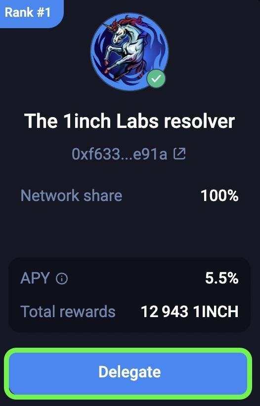
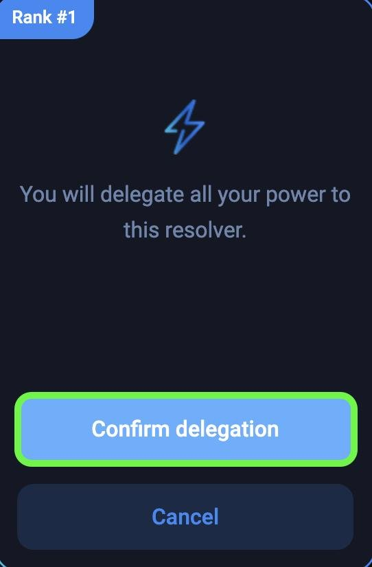

**How to delegate to a resolver:**

First, you will need to stake some 1INCH tokens.

Once you hold st1INCH, click on the "**Earn**" tab at the top of the page, and then "**Delegate**".

On the next screen you will see all of the available resolvers that can be delegated to. After choosing the desired resolver, click "**Delegate**".

 Next, click "**Confirm**" delegation, and then sign the transaction in your connected wallet.

 Once the transaction confirms on chain, you will have successfully delegated your Unicorn Power to the resolver.
