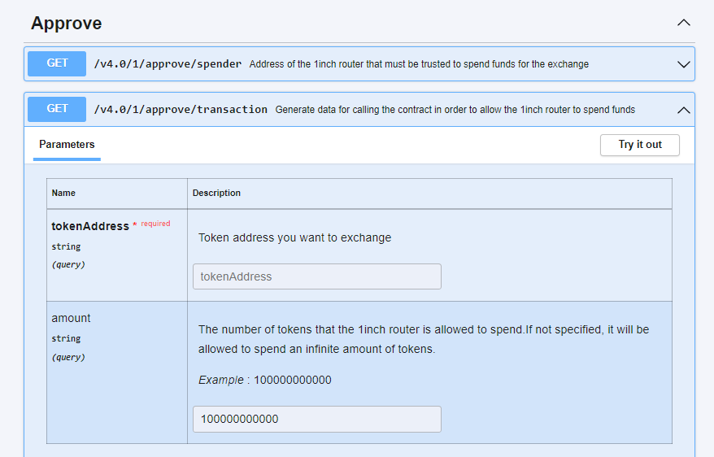
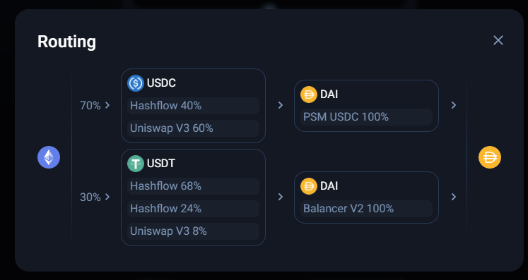

<h1>1inch API troubleshooting</h1>

<h1>Quick links:</h1>

[What is the rate limit?](https://help.1inch.io/en/articles/5998758-1inch-api-troubleshooting#h_cdaa0dc28c)

["Insufficient Liquidity" error](https://help.1inch.io/en/articles/5998758-1inch-api-troubleshooting#h_26a92a140f)

["Cannot Estimate"](https://help.1inch.io/en/articles/5998758-1inch-api-troubleshooting#h_fdfd390620)

[Insufficient allowance / balance](https://help.1inch.io/en/articles/5998758-1inch-api-troubleshooting#h_57ea327d34)

[What are the "parts" parameters?](https://help.1inch.io/en/articles/5998758-1inch-api-troubleshooting#h_caa7c96bf6)

[What is the "Complexity level?"](https://help.1inch.io/en/articles/5998758-1inch-api-troubleshooting#h_f7a65b4db1)

---

<h2>What is the rate limit?</h2>

The rate limit is variable, depending on the current load of the server queried.

---

<h2>"Insufficient Liquidity" error</h2>

This error can occur for a number of reasons:

* The liquidity pool has not been queried - make sure one of the aggregated sources has at least 10k of a connector token listed below.
* If you're getting a quote, please make sure to take into account the decimals of the token. Do not include decimal places in the "from token amount". The API returns the number of decimal places the token supports when calling /quote or /swap
* There's an error in the server and is unable to find a path, this may require contacting the 1inch support team for more investigation.

---

<h2>"Cannot Estimate"</h2>

This error occurs when the eth_estimateGas RPC call throws an error. There are many reasons why this can throw an error, and they all tend to mean the transaction is guaranteed to fail. This is a protection, so a transaction is broadcast that's going to fail. To find the precise error, disableEstimate=true can be used in the query and an eth_estimateGas RPC call can be done locally. The transaction can also be simulated with a platform like tenderly or blocknative for a better look at the transaction trace.

Some common reason why a transaction may fail:

* A token has a fee on transfer or swap and the slippage tolerance needs to be increased
* A token has a fee on transfer _and_ the fee and referrer parameter is set causing the transaction to always fail
* The rate has expired and changed in the latest block.

---

<h2>Troubleshooting insufficient allowance / balance</h2>

In the case of one of these errors, you may not have a[ token approval](https://help.1inch.io/en/articles/6147312-token-approvals) or you're missing the token balance. To do a token approval, you can use the API to approve the token to the 1inch router.

---

<h2>What are the "parts" parameters?</h2>

The parts parameters is comprised of 3 things

* mainRouteParts
* virtualParts
* parts

Each of these has their own unique meaning. The main route parts denotes the initial split and can be seen on the UI. In this example it's the 70%/30% split

The parts parameter is how many individual blocks there can be. In the picture above we can see 4 blocks with the top being the first main route part with 2 parts to it and the bottom one being the second main route part with 2 parts in it.

The virtual parts is the splits _inside_ of a part. We can see in the first main route part above, in the first block there are 2 virtual parts splitting the USDC between hashflow and uniswap. In the second main route part we can see three virtual parts in the first block, a hashflow route with 2 different rates and one to uniswap.

---

<h2>What is the "Complexity level?"</h2>

Complexity level is how many steps a swap can go through, below are the levels and what it means for the swap. Each level adds to the previous level.

* Complexity level 0 - the source token can be wrapped or unwrapped and swapped through one liquidity pool per main route part.
* Complexity level 1 - the source token can be wrapped or unwrapped and swapped through two liquidity pools. This means there can be up to one connector token in each main route part.
* Complexity level 2 - the source token can be wrapped or unwrapped and swapped through three liquidity pools. This means there can be up to two connector tokens in each main route part. **This is the default setting**
* Complexity level 3 - the source token can be wrapped or unwrapped and swapped through four liquidity pools. This means there can be up to three connector tokens in each main route part.

---

<h2>How can I limit the liquidity sources in the query?</h2>

To limit the liquidity sources to a query, select them using the "protocols" parameter as a CSV list of liquidity sources.

https://api.1inch.io/v4.0/1/quote?protocols=SHIBASWAP,CLIPPER,SUSHI,UNISWAP_V2,ONE_INCH_LIQUIDITY_PROTOCOL,ONE_INCH_LP_1_1&...

<h2>Still have questions?</h2>

Reach out to the community on[ https://www.discord.gg/1inch](https://www.discord.gg/1inch) or search around communities like stack overflow or github