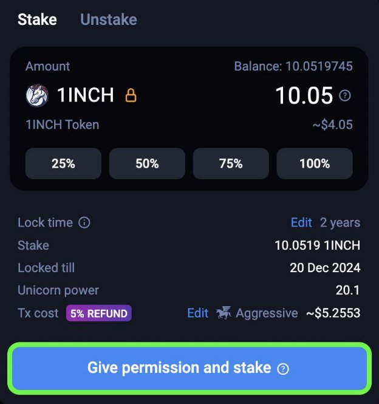
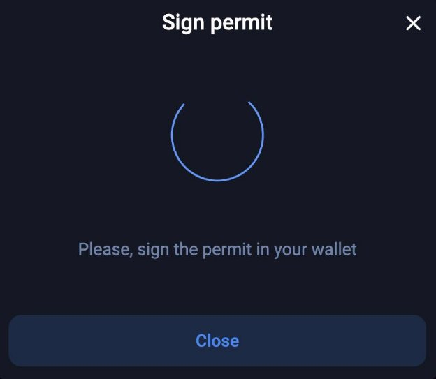

import DropDown from './assets/Dropdown.jsx' 

First connect your wallet. Then click on the “DAO” tab, followed by “Staking”.
<!-- this is a comment -->
<!---->

<DropDown/>

Next, enter the amount of 1INCH you would like to stake, set the locking period (default is 2 years) and click “Give permission to stake”. Then sign the transaction in your connected wallet.

This will permit the 1INCH tokens to be used by the smart contract *and* stake them in one single transaction. Once completed, your 1INCH tokens will be staked! You will then be able to see the total amount of tokens staked, your lock period, and your total Unicorn Power (used for delegation or 1inch DAO governance voting).

*Please note: Unstaking before the end of the lock period will result in a penalty.*
