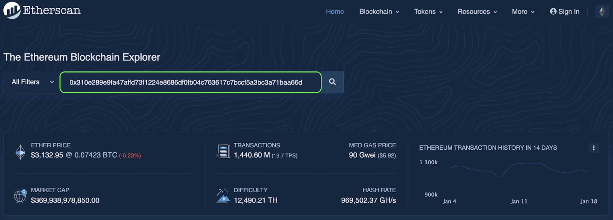
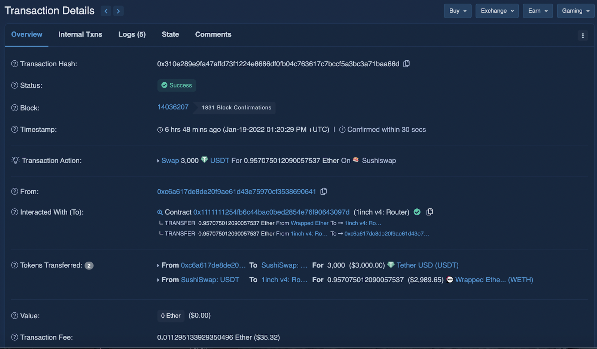
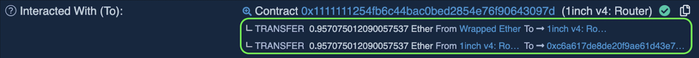
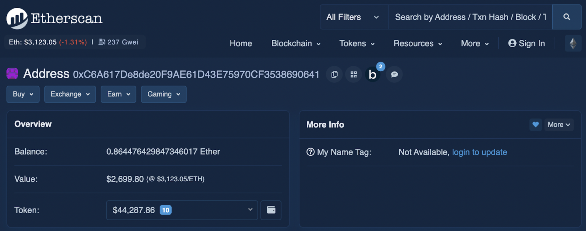
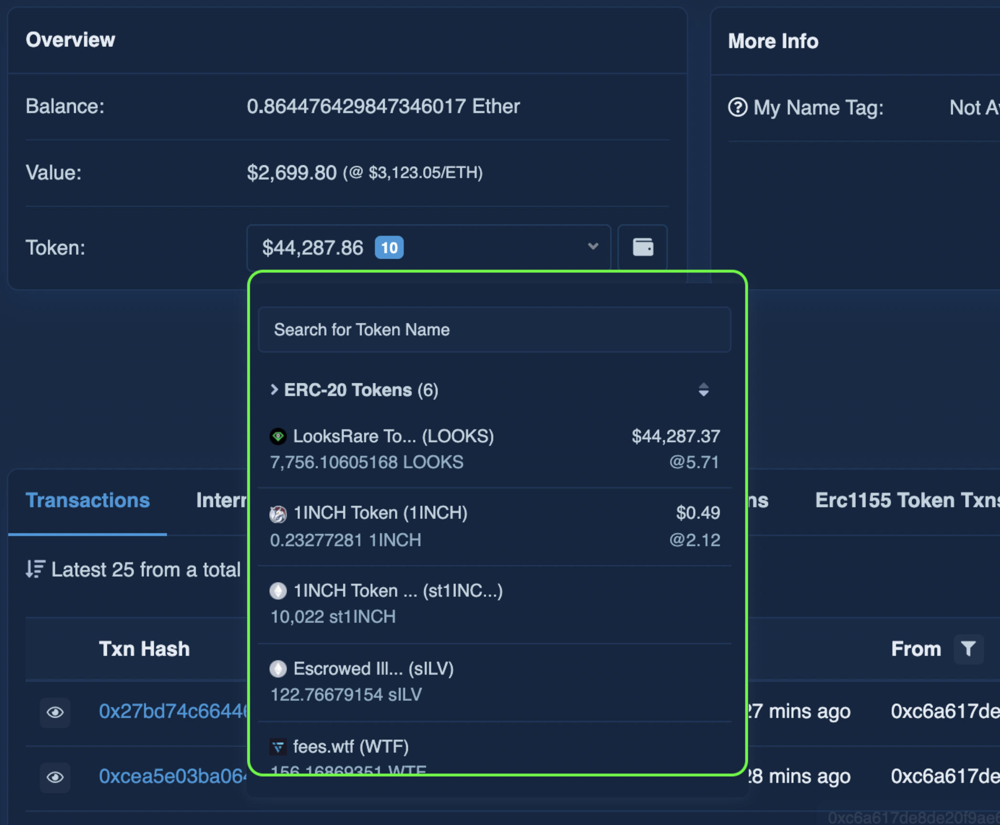
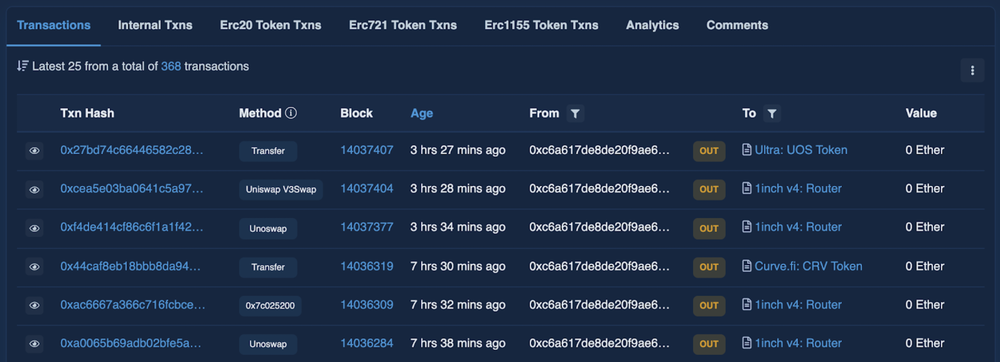

#### A basic overview of how to use block explorers, and how to view a wallet's history on-chain

A block explorer is a place where you can view every wallet address (and its history), along with every transaction and details that have been recorded on a blockchain network. They are very helpful for diagnosing issues with a transaction or wallet balance. All of the information shown on a block explorer is public.

You can find the block explorer for each 1inch-supported network here:

[Aurora](https://aurorascan.dev/)

[Arbitrum](https://arbiscan.io/)

[Avalanche](https://explorer.avax.network/)

[BNB Chain](https://bscscan.com/)

[Ethereum](https://etherscan.io/)

[Fantom](https://ftmscan.com/)

[Gnosis](https://blockscout.com/xdai/mainnet/)

[Klaytn](https://scope.klaytn.com/)

[Optimism](https://optimistic.etherscan.io/)

[Polygon](https://polygonscan.com/)

These tools will allow you to search for transactions, wallet addresses, tokens, ENS name tags, labels, and even websites.

#### **Labels/terminology explained**

* **Transaction Hash:** This is a unique identifier for the transaction. It is a 64-character hexadecimal string that represents the transaction on the Ethereum blockchain.

* **Block Height:** This is the block number in which the transaction was included in the blockchain. It is an integer that indicates how many blocks have been mined on the blockchain since its inception.

* **Timestamp:** This is the time at which the transaction was confirmed by the network. It is represented in Unix time, which is the number of seconds that have elapsed since January 1, 1970.

* **Transaction Type:** This indicates the type of transaction that was performed. Ethereum transactions can be either a transfer of ETH, a contract creation, a contract interaction, or other types of transactions.

* **Gas Limit:** This is the maximum amount of gas that the sender is willing to pay for the transaction. Gas is the unit of computation on the Ethereum blockchain and is used to pay for the execution of smart contracts.

* **Gas Used:** This is the actual amount of gas that was consumed by the transaction. It represents the amount of computational work that was performed by the network.

* **Gas Price:** This is the price that the sender is willing to pay per unit of gas. It is denominated in Gwei, which is a subunit of ETH.

* **Sender:** This is the Ethereum address that initiated the transaction. It is represented as a 40-character hexadecimal string.

* **Contract Address:** This is the Ethereum address of the smart contract that was created or interacted with by the transaction. If the transaction is a simple transfer of ETH, this field will be empty.

* **Input Data:** This is the input data that was sent along with the transaction. It can be used to pass parameters to a smart contract or to include a message with the transaction.

* **Value:** This is the amount of ETH that was transferred with the transaction. If the transaction is a contract creation or interaction, this field will be zero.

_***Note: Both transaction hashes and wallet addresses will always start with "0x", however the transaction hash is a longer string of characters._

#### **How to view/read a transaction **

To look up a specific transaction on a block explorer, simply copy and paste your transaction hash / ID from your wallet app or the 1inch dApp interface, into the search bar.

_***To find the transaction hash / ID on the 1inch desktop site, click your address in the upper right corner of the page, then "Transaction History". From here, you will be able to see all of your transactions and associated hashes._

In this example, we will use the following transaction:[ 0x310e289e9fa47affd73f1224e8686df0fb04c763617c7bccf5a3bc3a71baa66d](https://etherscan.io/tx/0x310e289e9fa47affd73f1224e8686df0fb04c763617c7bccf5a3bc3a71baa66d)

In this transaction, a user successfully swapped 3,000 USDT for .0957 ETH (shown under "Transaction Action"). The contract that facilitated the swap was the 1inch v4: Router, and routed the swap through the 'Sushiswap' Liquidity Source. The total gas fee paid amounts to .011295. At first glance, you might think that the user wanted to swap USDT->WETH; however, you can see under the "Interacted with (To)" category that after receiving WETH, the contract then swapped the WETH for ETH, and sent the ETH to the user's wallet:

The wallet that initiated the swap is shown under the "From" category:

---

#### **How to view a wallet address (basic):**

To look up a specific wallet address on a block explorer, simply copy and paste the address from your wallet app or the 1inch dApp interface, into the search bar. (We will use the address from the transaction example above.)

Here, you will be able to view all of the existing assets within the wallet, along with a complete history of all transactions.

In addition to basic transaction history, you can also view different categories such as: Internal transactions, ERC20 Token transactions (a similar breakdown to basic transactions, just categorized by ERC20 tokens instead of native tokens, i.e. ETH), ERC115 Token transactions, and Analytics, and public Comments on the wallet.

**Questions, comments, concerns? Feel free to reach out to us on [Discord](https://discord.gg/1inch), or in the Live Support Chat on [app.1inch.io](https://app.1inch.io/)**.
