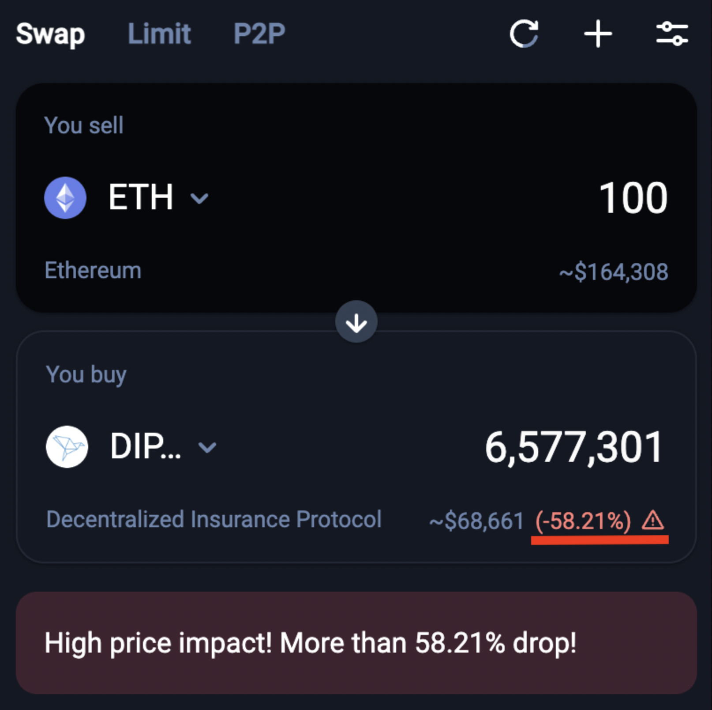
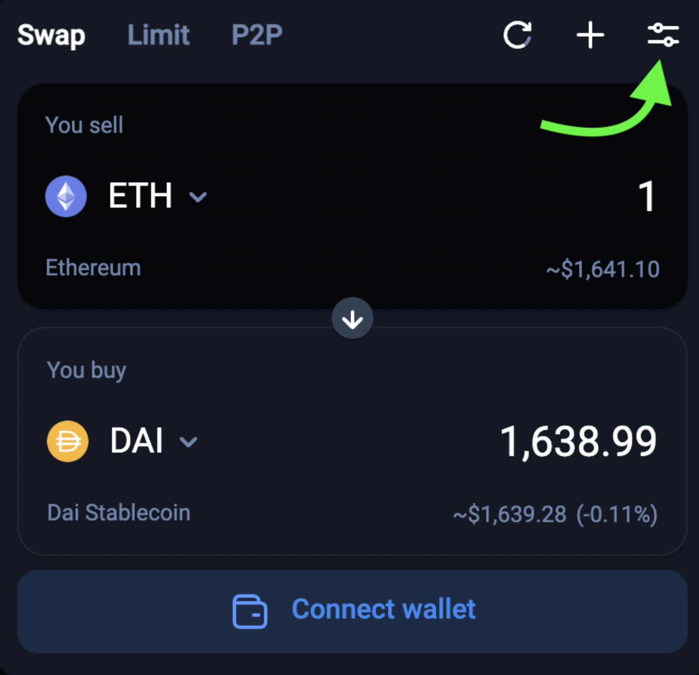
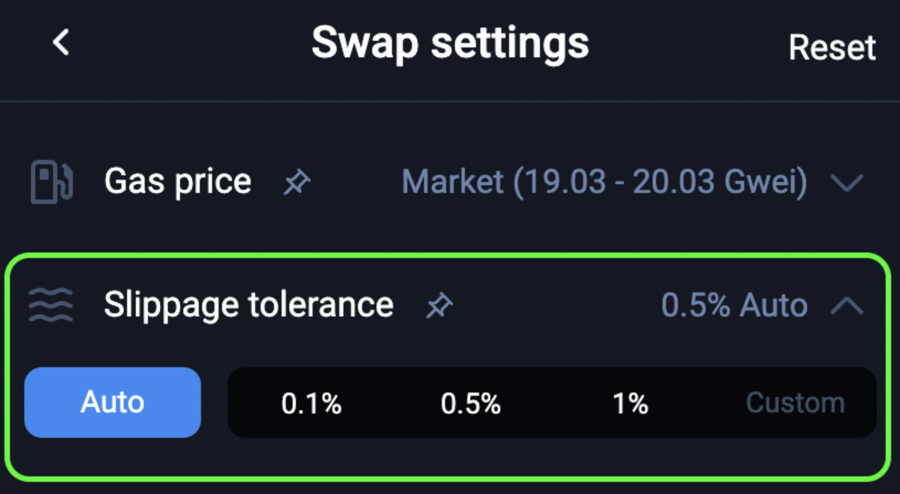
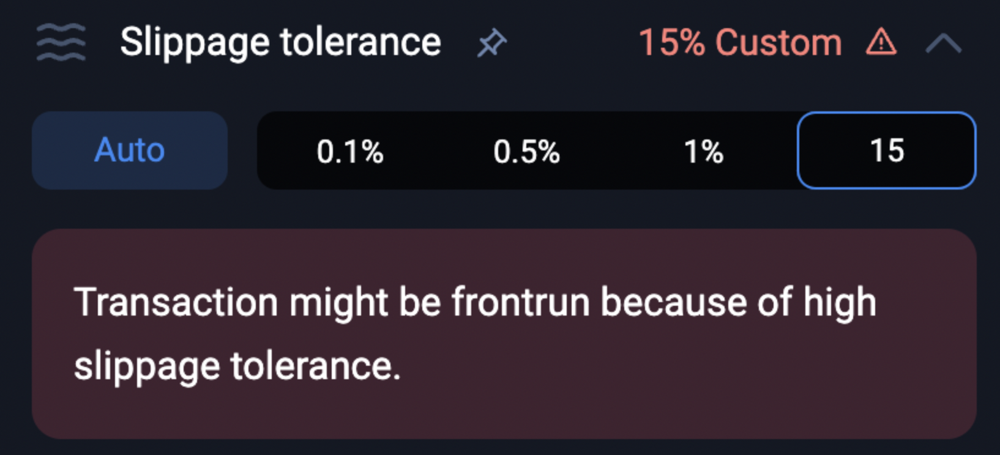
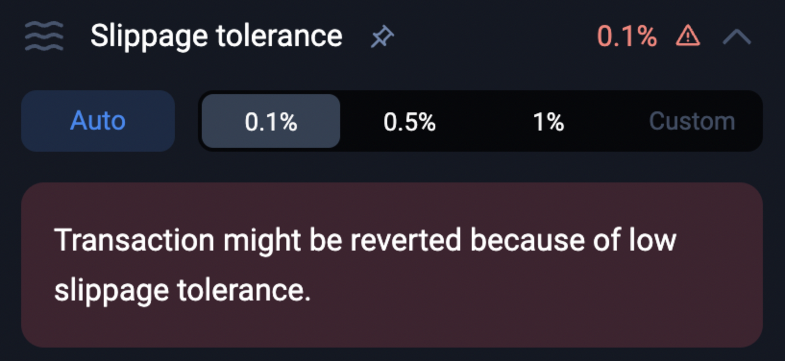

## What is price impact vs. slippage in DeFi?

How to protect yourself from these two market dynamics when swapping on 1inch Network

**In this article, we will cover:**

What is price impact?
What is the difference between Price Impact and Price Slippage?
How to minimize negative price impact
How to control slippage
What happens if I set the slippage tolerance too high or too low for a transaction?

---

### **What is Price Impact?**

Price impact is the influence of user's individual trade over the market price of an underlying asset pair. It is directly correlated with the amount of liquidity in the[ pool / Automated Market Maker (AMM)](https://medium.com/dragonfly-research/what-explains-the-rise-of-amms-7d008af1c399). Price impact can be especially high for illiquid markets/pairs, and may cause a trader to **_lose a significant portion of their funds._**

Here is an extreme example of an illiquid swap on 1inch that would have a negative price impact:

If the user in this example were to continue with the swap, they would be trading $164,308 worth of ETH for $68,661 worth of DIP. This is because there are not enough sellers of DIP at the current market price to fulfill an order of this size. 

**Put figuratively, the one single large trade would make a big splash in the small pool.**

Price impact can also be positive too! If the pool is imbalanced in the opposite direction, your trade might take place at a discount relative to the pool. This is also known as an arbitrage opportunity.

### **What is the difference between Price _Impact_ and Price _Slippage_?**

Price impact and price slippage are very similar; however, **there is a nuance**.

**_Price slippage_** refers to the change in price caused by external broad market movements (unrelated to your trade).   
**_Price impact_** refers to the change in price directly caused by your own trade itself.

Like price impact, slippage is also highly dependent upon the liquidity in a pool. If the token pair as a low amount of liquidity, it takes smaller collective market movements to cause significant changes to the pool's rate.

Slippage can be positive as well. If the rate changes in a favorable direction, a surplus amount of tokens is returned for the swap. Currently on 1inch network, 100% of the "swap surplus" is[ distributed to the 1inch Network Treasury and Referrers](https://blog.1inch.io/the-road-to-decentralization-ddee58d3b198).

### **How to minimize negative price impact**

By design, the 1inch Network pathfinder algorithm will automatically split your trade amount between multiple liquidity sources. This ensures that you will have minimal negative price impact for your trade.

_Please note: The 1inch router cannot optimize price impact for illiquid tokens with only one liquidity source._

To manually reduce the price impact of a swap, you can reduce the amount swapped, or wait for more liquidity to enter the market. For many "less reputable projects" or[ scam tokens](https://help.1inch.io/en/articles/5363502-5-tools-to-identify-a-defi-scam-token), this liquidity will never show up. Also, it is strongly recommended to confirm that the amount of tokens in the "You Receive" section is the correct amount of tokens for the current market rate.

### **How to control slippage**

1inch has a very effective tool for handling slippage. It is called the "slippage tolerance" feature, and allows users to set a desired percentage of tolerable slippage for their trade.

_***By default, 1inch utilizes "auto-slippage", which detects the volatility of your token pair and adjusts the slippage tolerance accordingly._

This feature can be accessed within the swap settings.

_***For users' convenience, the 'slippage tolerance' indicator can be pinned to the swap page by clicking on the pin icon next to it in the settings._

If the returned token amount falls beyond the allotted slippage tolerance between the time of submission and the time of confirmation, the transactions will fail. 

While failed transactions cost gas fees (that[ cannot be returned](https://help.1inch.io/en/articles/4825408-can-i-get-a-refund-from-1inch-network)), it prevents a further loss of funds do to the slippage.

### **What happens if I set the slippage tolerance too high or too low for a transaction?**

There is often a "sweet spot" for setting the slippage tolerance. This ideal amount varies based on each individual token, transaction, and your personal risk tolerance.

**Too High:**

When the slippage tolerance is set really high, it allows the transaction to still complete despite large price swings. This can open the door to front-running and sandwich attacks. A sandwich attack is a variation of front-running, where an attacker sees a pending transaction, then places a significantly larger transaction (with the same tokens) directly before and after the victim’s transaction. This drives the price of the victim’s transaction up, effectively allowing the front runner to extract the difference in value. Since the victim's slippage tolerance is so high, the attacker can extract that much value from the attack. This could easily be prevented by setting a lower slippage tolerance in combination with enabling the "partial fill" setting, or using the[ 'Flashbots' feature](https://help.1inch.io/en/articles/5300755-what-are-flashbot-transactions-and-how-do-they-work-on-1inch-help-center).

**Too Low:**

If the slippage tolerance is set too low, then the transaction can fail (revert) if the price moves beyond the % that was set. While a low tolerance can prevent front running, it can also cause a loss of gas fees to the failed transaction.

If you do incur a failed transaction due to a low slippage tolerance, it will show "Fail with error 'Mon return not reached' when viewing the transaction on the block explorer:

**Questions, comments, concerns? Feel free to let us know in the live support chat!**